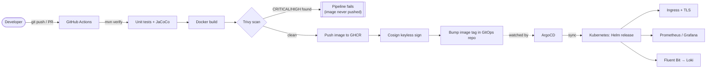

# sample-app-delivery-pipeline — Production CI/CD Pipeline

A production-grade CI/CD pipeline for a Spring Boot ("sample-app") service:
GitHub Actions (test → build → scan → tag → sign → push) → GitOps (ArgoCD) →
Kubernetes (Helm) → Ingress/TLS → Observability (Prometheus/Grafana/Loki).

This README is the **exact, ordered sequence of commands** to stand the whole
thing up from a clean checkout. For the *why* behind each step, read
[`docs/GUIDE.md`](docs/GUIDE.md) — this file is the *how*, kept deliberately
terse and copy-pasteable. If a command here and the guide ever disagree,
this README is the one to trust (it was verified against the actual files in
this repo).

## Problem this solves

Manual deploys don't scale past the first few releases: someone SSHes in,
copies a jar, restarts a service, and hopes nothing regressed. There's no
audit trail, no automatic security check, and no easy rollback. This repo
removes every one of those manual steps for a Spring Boot service — every
merge to `main` is automatically tested, containerised, scanned for known
CVEs, signed, and deployed via GitOps, so "did we deploy the reviewed code,
unmodified, with a known-clean dependency tree" always has a checkable
answer instead of a "trust me."

## Architecture



The app repo (this one) never holds cluster credentials and the pipeline
never talks to the cluster directly — it only ever writes a new image tag to
a separate GitOps repo. ArgoCD is the only thing with cluster write access,
and it only acts on what's committed in git. That indirection is deliberate:
it means every production change has a corresponding git commit, and a
compromised CI token can push a bad image tag reference at worst, not touch
the cluster.

---

## 0. Repository layout

```
.
├── Dockerfile                       # multi-stage build (Maven -> JRE runtime)
├── .dockerignore
├── .github/workflows/ci-cd.yml      # test -> build -> scan -> tag -> push -> update-gitops
├── docs/GUIDE.md                    # full narrative walkthrough (read for context)
├── helm/sample-app/                 # Helm chart (the app's K8s definition)
│   ├── Chart.yaml
│   ├── values.yaml                  # dev/local defaults
│   ├── values-prod.yaml             # prod overrides (image.tag is patched by CI)
│   └── templates/                   # Deployment, Service, Ingress, HPA, PDB, ConfigMap, ServiceAccount, ServiceMonitor
├── gitops/
│   ├── argocd/application.yaml      # ArgoCD Application object (cluster admin applies once)
│   ├── argocd/README.md             # shape of the separate GitOps config repo
│   └── external-secret-example.yaml # production secrets pattern (External Secrets Operator)
└── observability/
    ├── kube-prometheus-stack-values.yaml
    ├── fluent-bit-values.yaml
    ├── cluster-issuer.yaml          # cert-manager Let's Encrypt ClusterIssuer
    └── sample-app-alerts.yaml       # PrometheusRule (4 starter alerts)
```

**This repo is the "app repo."** It owns source, `Dockerfile`, CI, and the
Helm chart *template*. It never holds cluster credentials. A **second,
separate repo** — the "GitOps repo" — owns only rendered `values-*.yaml`
files and is what ArgoCD watches. You must create that second repo yourself
(Step 3 below); it does not ship inside this bundle.

---

## 1. Prerequisites — install and verify every one of these before starting

| Tool | Verify | Notes |
|---|---|---|
| Java 17 (Temurin) | `java -version` | Must show `17.x`. Only needed for local (non-Docker) test runs. |
| Maven 3.9+ | `mvn -version` | Only needed for local (non-Docker) test runs. |
| Docker Desktop / Docker Engine | `docker version` | Must be running before any `docker build`. |
| Trivy | `trivy --version` | `brew install trivy` (macOS) or see [trivy docs](https://aquasecurity.github.io/trivy). |
| kubectl | `kubectl version --client` | Any recent version. |
| Helm 3 | `helm version` | v3.12+ recommended. |
| A Kubernetes cluster | `kubectl cluster-info` | `kind`, `minikube`, EKS/GKE/AKS — anything works. Local instructions below use `kind`. |
| `kind` (if going local) | `kind version` | `brew install kind`. |
| `yq` (v4, Go version — **not** the Python `yq`) | `yq --version` → must print `yq (https://github.com/mikefarah/yq/) version v4...` | `brew install yq`. CI uses this exact tool to patch `values-prod.yaml`. |
| `cosign` | `cosign version` | `brew install cosign`. Only needed if you want to verify/sign images locally. |
| GitHub CLI (optional) | `gh --version` | Convenient for repo/secret setup, not required. |

A GitHub account with permission to create repos and Actions secrets on the
account/org that will host this project.

---

## 2. Application prerequisite — Actuator endpoints must exist

This pipeline assumes the Spring Boot app already exposes health and metrics
endpoints. Before doing anything else, confirm `pom.xml` has:

```xml
<dependency>
  <groupId>org.springframework.boot</groupId>
  <artifactId>spring-boot-starter-actuator</artifactId>
</dependency>
<dependency>
  <groupId>io.micrometer</groupId>
  <artifactId>micrometer-registry-prometheus</artifactId>
</dependency>
```

and `src/main/resources/application.properties` has:

```properties
server.port=8000
management.endpoints.web.exposure.include=health,info,prometheus
management.endpoint.health.probes.enabled=true
management.health.livenessState.enabled=true
management.health.readinessState.enabled=true
```

If either is missing, add it and commit before continuing — the
`HEALTHCHECK` in the Dockerfile, the Kubernetes liveness/readiness probes in
`helm/sample-app/values.yaml`, and the Prometheus `ServiceMonitor` all assume
port `8000` and the `/actuator/*` paths. If your app uses a different
framework or port, you must edit **all three** of: `Dockerfile` (EXPOSE +
HEALTHCHECK), `helm/sample-app/values.yaml` (`service.port`, probes,
`podAnnotations`), and `helm/sample-app/templates/servicemonitor.yaml`
consistently, or the pipeline will deploy a service Kubernetes can't health-check.

Also delete any hardcoded secrets in application source (the original
version of this project had a GitHub PAT in `RepositoryDetailsController`
and Twitter API keys in a raw `deployment.yaml` — if you copied from that
version, remove both; Section 8 below shows the replacement).

---

## 3. Create the two GitHub repositories

You need **two** repos. Names below match what's hardcoded in this bundle —
either use these exact names or find/replace every occurrence listed in
parentheses.

1. **App repo**: `Auduj01/sample-app-delivery-pipeline`
   (referenced in `.github/workflows/ci-cd.yml` line `repository:
   Auduj01/sample-app-delivery-pipeline-gitops`, and in `helm/sample-app/values.yaml` /
   `values-prod.yaml` as `image.repository: ghcr.io/auduj01/sample-app-delivery-pipeline`)
   — push the contents of this bundle here.

2. **GitOps repo**: `Auduj01/sample-app-delivery-pipeline-gitops`
   (referenced in `.github/workflows/ci-cd.yml` and `gitops/argocd/application.yaml`)
   — create it empty, then add this exact structure:

   ```
   sample-app-delivery-pipeline-gitops/
   └── apps/
       └── sample-app/
           └── values-prod.yaml
   ```

   Seed `values-prod.yaml` in the **GitOps repo** with a copy of this
   bundle's `helm/sample-app/values-prod.yaml` content. CI will overwrite
   only the `image.tag` field on every deploy via `yq`.

If you use different GitHub usernames/repo names, update every reference:

```bash
grep -rn "Auduj01\|auduj01\|sample-app-delivery-pipeline" \
  .github/workflows/ci-cd.yml \
  helm/sample-app/values.yaml \
  helm/sample-app/values-prod.yaml \
  gitops/argocd/application.yaml \
  gitops/argocd/README.md
```

Push this bundle to the app repo's `main` branch:

```bash
git init
git add .
git commit -m "Initial commit: production CI/CD pipeline"
git branch -M main
git remote add origin https://github.com/<you>/sample-app-delivery-pipeline.git
git push -u origin main
```

---

## 4. Configure GitHub repo settings (app repo)

### 4.1 Branch protection on `main`
GitHub UI → app repo → **Settings → Branches → Add rule** for `main`:
- Require status checks to pass before merging → select `test` and `build-scan-push` (these appear only after the workflow has run at least once, so you may need to open one PR first before you can select them).
- Require at least 1 approving review.
- Do not allow force pushes or deletions.

### 4.2 Actions permissions
**Settings → Actions → General → Workflow permissions**: leave the default
`GITHUB_TOKEN` scope; the workflow declares its own `permissions:` block
(`contents: read`, `packages: write`, `security-events: write`,
`id-token: write`) so no extra scope is needed here — just make sure
"Allow GitHub Actions to create and approve pull requests" is **not**
required (it isn't used) and that Actions are enabled at all
(**Settings → Actions → General → Actions permissions** → "Allow all
actions and reusable workflows").

### 4.3 Repository secret: `GITOPS_PAT`
The `update-gitops` job needs write access to the **separate** GitOps repo,
which the default `GITHUB_TOKEN` cannot provide (it's scoped to the repo the
workflow runs in).

1. Create a fine-grained PAT: GitHub → your avatar → **Settings → Developer
   settings → Personal access tokens → Fine-grained tokens → Generate new
   token**.
   - Repository access: only `sample-app-delivery-pipeline-gitops`.
   - Permissions: **Contents: Read and write**.
   - Expiration: set a real expiry and calendar-remind yourself to rotate it.
2. Copy the token immediately (shown once).
3. App repo → **Settings → Secrets and variables → Actions → New repository
   secret**:
   - Name: `GITOPS_PAT`
   - Value: the token from step 2.

Do **not** use a classic PAT with broader scope than necessary, and never
commit this token to any file.

### 4.4 GHCR package visibility
The first push creates a package at `ghcr.io/<owner>/sample-app-delivery-pipeline`.
By default new GHCR packages linked to a repo inherit its visibility. If
your app repo is private, either keep the package private (and set up an
`imagePullSecret`, Section 8.1) or make the package public: package page on
GitHub → **Package settings → Change visibility**.

---

## 5. Run the CI pipeline

Nothing to configure here beyond Sections 3–4 — the workflow triggers
automatically:

```bash
git checkout -b test/verify-pipeline
# make a trivial change, e.g. touch a comment
git commit -am "test: verify pipeline"
git push -u origin test/verify-pipeline
gh pr create --fill   # or open the PR in the GitHub UI
```

Watch the **`test`** job run on the PR (Actions tab, or `gh pr checks`).
It runs `mvn -B clean verify` and publishes a JUnit report + JaCoCo coverage
artifact. It must go green before merge.

Merge the PR to `main`. This triggers, in order:

1. `test` — re-runs on `main`.
2. `build-scan-push` (needs `test` to pass):
   - Builds the image (not yet pushed) tagged `sha-<commit>` and (on `main`) `latest`.
   - Scans it with Trivy; **fails the whole job on any CRITICAL/HIGH CVE** and uploads SARIF to the repo's Security tab.
   - Only if the scan passes: pushes the image to `ghcr.io/<owner>/sample-app-delivery-pipeline`.
   - Signs the pushed image keylessly with `cosign` (uses GitHub OIDC — no key management).
3. `update-gitops` (needs `build-scan-push`, only on `main`): checks out the GitOps repo with `GITOPS_PAT`, runs `yq -i ".image.tag = \"sha-<sha>\"" apps/sample-app/values-prod.yaml`, commits, and pushes.

Verify each step actually happened:

```bash
gh run list --workflow=ci-cd.yml --limit 5
gh run view --log   # inspect the latest run in detail
```

Confirm the image landed in GHCR:

```bash
docker pull ghcr.io/<owner>/sample-app-delivery-pipeline:sha-<the-commit-sha>
```

Confirm the GitOps repo was updated:

```bash
git clone https://github.com/<you>/sample-app-delivery-pipeline-gitops.git /tmp/gitops-check
cat /tmp/gitops-check/apps/sample-app/values-prod.yaml   # image.tag should be sha-<latest commit>
```

A release build (semver tag) works the same way but is cut manually:

```bash
git tag v1.0.0
git push origin v1.0.0
```

**Cutting a version tag alone does not trigger `update-gitops`** — that job
only runs `if: github.ref == 'refs/heads/main'`. Version tags produce a
signed, scanned image in GHCR for audit/rollback purposes; the deployed tag
is always the `sha-` tag from the `main` push.

---

## 6. Prove the image locally before trusting CI (optional but recommended the first time)

```bash
docker build -t sample-app:local .
docker run --rm -p 8000:8000 --name sample-app-local sample-app:local
```

In a second terminal:

```bash
curl -sf localhost:8000/actuator/health && echo OK
curl -s localhost:8000/actuator/prometheus | head -20
docker stop sample-app-local
```

Scan it exactly like CI does:

```bash
trivy image sample-app:local --severity CRITICAL,HIGH --exit-code 1 --ignore-unfixed
```

If this fails locally, it will fail in CI — fix the base image / dependency
before pushing.

---

## 7. Stand up a Kubernetes cluster

### Option A — local (`kind`), for testing the whole pipeline end to end

```bash
kind create cluster --name sample-app-demo
kubectl cluster-info --context kind-sample-app-demo
```

### Option B — a real cloud cluster (EKS/GKE/AKS)
Provision it with your normal process (Terraform, `eksctl`, `gcloud
container clusters create`, etc. — out of scope for this bundle) and make
sure your local `kubectl` context points at it: `kubectl config
current-context`.

Everything from here on assumes `kubectl`/`helm` are pointed at the correct
cluster. **Double-check `kubectl config current-context` before every
`kubectl apply` / `helm install` if you manage more than one cluster** —
this is the single most common way to accidentally deploy to the wrong
place.

---

## 8. Install cluster-wide dependencies (once per cluster, in this order)

### 8.1 Namespace + registry pull secret
```bash
kubectl create namespace sample-app
kubectl create secret docker-registry ghcr-cred \
  --docker-server=ghcr.io \
  --docker-username=<your-github-username> \
  --docker-password=<a GitHub PAT with read:packages scope> \
  -n sample-app
```
Skip this if you made the GHCR package public (Section 4.4) — but
`helm/sample-app/values.yaml` still references `imagePullSecrets: [{name:
ghcr-cred}]` by default, so either create the secret anyway (harmless if
the image is public) or remove that block from `values.yaml`/`values-prod.yaml`.

### 8.2 Application secrets
The chart never accepts secret values directly — `values.yaml` only holds
`existingSecret: sample-app-secrets` (a name). Create the actual Secret by
one of these two paths:

**Quick/dev path** (imperative, fine for a first pass — but the values here
are your real app config, so never commit them anywhere):
```bash
kubectl create secret generic sample-app-secrets \
  --from-literal=CONSUMER_KEY=<value> \
  --from-literal=CONSUMER_SECRET=<value> \
  --from-literal=ACCESS_TOKEN=<value> \
  --from-literal=ACCESS_TOKEN_SECRET=<value> \
  -n sample-app
```

**Production path** — External Secrets Operator pulling from AWS Secrets
Manager (swap the backend for Vault/GCP/Azure as needed):
```bash
helm repo add external-secrets https://charts.external-secrets.io
helm repo update
helm install external-secrets external-secrets/external-secrets \
  -n external-secrets --create-namespace
kubectl apply -f gitops/external-secret-example.yaml
```
This requires an IRSA-annotated ServiceAccount named `sample-app` in the
`sample-app` namespace with permission to read the referenced AWS secret —
set that up in your cloud IAM before applying. If any field doesn't apply
to your actual app secrets, edit `gitops/external-secret-example.yaml`'s
`data:` list to match your real secret keys before applying.

### 8.3 ingress-nginx
```bash
helm repo add ingress-nginx https://kubernetes.github.io/ingress-nginx
helm repo update
helm install ingress-nginx ingress-nginx/ingress-nginx \
  -n ingress-nginx --create-namespace
kubectl get svc -n ingress-nginx   # on kind this stays <pending>; on cloud, wait for an EXTERNAL-IP
```

### 8.4 cert-manager + ClusterIssuer
```bash
helm repo add jetstack https://charts.jetstack.io
helm repo update
helm install cert-manager jetstack/cert-manager \
  -n cert-manager --create-namespace --set installCRDs=true
kubectl wait --for=condition=Available --timeout=120s -n cert-manager deployment/cert-manager
```
Before applying, edit `observability/cluster-issuer.yaml` and set a real
email address for Let's Encrypt notifications (search for `email:` in that
file), then:
```bash
kubectl apply -f observability/cluster-issuer.yaml
kubectl get clusterissuer letsencrypt-prod   # READY should become True
```
Let's Encrypt cannot issue a cert for a hostname it can't reach over the
public internet — this step only fully succeeds once your Ingress hostname
(Section 9) has real public DNS pointed at the ingress controller's
load balancer. On `kind`/local, expect this to stay pending; that's normal
and doesn't block the rest of the walkthrough (see Section 10 for local
access without TLS).

### 8.5 kube-prometheus-stack (Prometheus + Grafana + Alertmanager)

Before installing, this values file has two placeholders you must not
deploy as-is:
- `alertmanager.config.receivers[].slack_configs[].api_url` is literally
  `https://hooks.slack.com/services/REPLACE/ME` — create a real Incoming
  Webhook (Slack → Apps → Incoming Webhooks) and replace both occurrences,
  or alerts will silently fail to deliver.
- `grafana.adminPassword` is intentionally blank — never fill in a real
  password in this committed file. Supply it at install time instead:

```bash
helm repo add prometheus-community https://prometheus-community.github.io/helm-charts
helm repo update
helm install kube-prometheus-stack prometheus-community/kube-prometheus-stack \
  -n monitoring --create-namespace \
  -f observability/kube-prometheus-stack-values.yaml \
  --set grafana.adminPassword=<a-real-password>
kubectl wait --for=condition=Available --timeout=180s -n monitoring deployment/kube-prometheus-stack-operator
```

### 8.6 Loki + Fluent Bit (log pipeline)
```bash
helm repo add grafana https://grafana.github.io/helm-charts
helm repo update
helm install loki grafana/loki-stack -n logging --create-namespace
helm repo add fluent https://fluent.github.io/helm-charts
helm repo update
helm install fluent-bit fluent/fluent-bit -n logging \
  -f observability/fluent-bit-values.yaml
kubectl get pods -n logging   # fluent-bit should show one pod per node (DaemonSet)
```

### 8.7 ArgoCD
```bash
kubectl create namespace argocd
kubectl apply -n argocd -f https://raw.githubusercontent.com/argoproj/argo-cd/stable/manifests/install.yaml
kubectl wait --for=condition=Available --timeout=180s -n argocd deployment/argocd-server
```
Get the initial admin password and log in:
```bash
kubectl -n argocd get secret argocd-initial-admin-secret \
  -o jsonpath="{.data.password}" | base64 -d; echo
kubectl port-forward svc/argocd-server -n argocd 8080:443
# in a browser: https://localhost:8080  (user: admin, password: from above)
```
Change the admin password after first login (UI → User Info → Update Password),
or via CLI: `argocd account update-password`.

---

## 9. Wire up GitOps deployment

Confirm `gitops/argocd/application.yaml` points at your actual GitOps repo
(edit `spec.source.repoURL` if it doesn't match what you created in Section
3), then apply it once:

```bash
kubectl apply -f gitops/argocd/application.yaml
```

Watch ArgoCD pick it up and sync:
```bash
kubectl get application sample-app-prod -n argocd -w
# CTRL-C once SYNC STATUS = Synced and HEALTH STATUS = Healthy
```

Or via the ArgoCD UI (Section 8.7's port-forward): the `sample-app-prod`
tile should turn green.

This is a one-time bootstrap step. **From this point forward, every future
deploy is a `git push` to `main` in the app repo — never run `helm upgrade`
or `kubectl apply` against this app's resources by hand.** If you do,
`selfHeal: true` in `application.yaml` will revert it within minutes; that's
intentional, not a bug.

---

## 10. Verify the running application

```bash
kubectl -n sample-app get deploy,rs,pods,svc,ingress -o wide
kubectl -n sample-app rollout status deployment/sample-app
```

**If you have real DNS** pointed at the ingress controller's external IP
for the host in `helm/sample-app/values-prod.yaml` (default:
`sample-app.mydomain.com` — change this to a domain you actually control
before relying on TLS):
```bash
curl -sf https://sample-app.mydomain.com/actuator/health && echo OK
```

**If you're on `kind`/local without DNS**, bypass Ingress/TLS and hit the
Service directly:
```bash
kubectl -n sample-app port-forward svc/sample-app 8000:8000
curl -sf localhost:8000/actuator/health && echo OK
```

Check the JaCoCo/Actuator metrics path and confirm Prometheus is scraping:
```bash
kubectl -n sample-app port-forward svc/kube-prometheus-stack-prometheus 9090:9090 -n monitoring
# browser: http://localhost:9090/targets -> find "sample-app", state should be UP
```
(If it's not there, the most common cause is a label mismatch: the
`ServiceMonitor` must carry `release: kube-prometheus-stack` for the
Operator to notice it — check `helm/sample-app/templates/servicemonitor.yaml`
against whatever release name you used in Section 8.5.)

Open Grafana:
```bash
kubectl -n monitoring port-forward svc/kube-prometheus-stack-grafana 3000:80
# browser: http://localhost:3000
# observability/kube-prometheus-stack-values.yaml sets grafana.adminPassword
# to an empty string deliberately (a real value should never sit in a
# committed file) — before installing, override it out-of-band:
#   helm install ... --set grafana.adminPassword=<a-real-password>
# or better, point grafana.admin.existingSecret at a Secret you create
# yourself. Either way, fetch the actual in-cluster value with:
kubectl -n monitoring get secret kube-prometheus-stack-grafana \
  -o jsonpath="{.data.admin-password}" | base64 -d; echo
# username is "admin" unless overridden
```
Confirm the JVM/Spring Boot dashboard is populated with live data.

---

## 11. Prove the full loop end-to-end

Make a trivial, visible code change and push it through the whole chain
without ever touching the cluster by hand:

```bash
git checkout main && git pull
# edit something small and visible, e.g. a log line or response field
git commit -am "test: prove end-to-end pipeline"
git push origin main
```

Then, in order:
1. `gh run watch` (or the Actions tab) — confirm `test` → `build-scan-push` → `update-gitops` all go green.
2. `git -C /tmp/gitops-check pull` (re-clone if needed) — confirm `image.tag` changed to the new `sha-`.
3. `kubectl get application sample-app-prod -n argocd -w` — confirm ArgoCD detects the diff and syncs (usually within its polling interval, default 3 minutes, or immediately if a webhook is configured).
4. `kubectl -n sample-app rollout status deployment/sample-app` — confirm a new ReplicaSet rolls out with zero downtime (`maxUnavailable: 0`, `maxSurge: 1` — watch pod count never drop below the old replica count during the rollout).
5. Re-run the curl/health check from Section 10 and confirm the new behavior is live.

If all five steps complete, the pipeline is proven: **every deploy is a
`git push`, nothing else.**

---

## 12. Rollback

Two independent rollback paths exist — use the GitOps one for anything that
matters:

**GitOps rollback (correct way — leaves an audit trail):**
```bash
git -C /tmp/gitops-check revert HEAD --no-edit   # reverts the last image.tag bump
git -C /tmp/gitops-check push
```
ArgoCD detects the reverted `values-prod.yaml` and reconciles back automatically.

**Emergency Kubernetes-native rollback (fast, but ArgoCD's `selfHeal` will
undo it again once it notices — only use this to stop the bleeding while
you also do the GitOps revert above):**
```bash
kubectl -n sample-app rollout undo deployment/sample-app
```

---

## 13. Common failure points and what they mean

| Symptom | Cause | Fix |
|---|---|---|
| `update-gitops` job fails with a 403/permission error | `GITOPS_PAT` missing, expired, or scoped to the wrong repo | Regenerate per Section 4.3 |
| `build-scan-push` fails at the Trivy step | A real CRITICAL/HIGH CVE in the base image or a dependency | Bump the base image tag in `Dockerfile`, or `mvn versions:use-latest-releases` on the vulnerable dependency; re-run Section 6 locally before re-pushing |
| ArgoCD shows `OutOfSync` forever | `spec.source.repoURL` in `gitops/argocd/application.yaml` doesn't match your actual GitOps repo, or the PAT ArgoCD uses to read it (if private) isn't configured as an ArgoCD repo credential | `argocd repo add <url> --username <u> --password <token>` |
| Pod stuck in `ImagePullBackOff` | `ghcr-cred` secret missing/wrong, or the GHCR package is private and unreachable | Recheck Section 8.1 and 4.4 |
| Pod stuck in `CrashLoopBackOff` | Usually a missing/misnamed key in `sample-app-secrets`, or the app can't bind port 8000 | `kubectl -n sample-app logs deploy/sample-app --previous` |
| `ServiceMonitor` exists but target never appears in Prometheus | Label mismatch — `release: kube-prometheus-stack` on the ServiceMonitor must match the Helm release name from Section 8.5 | `kubectl -n sample-app get servicemonitor sample-app -o yaml \| grep release` and compare to `helm list -n monitoring` |
| `ClusterIssuer` never goes `Ready` | DNS for the Ingress host doesn't point at the ingress controller's public IP yet (Let's Encrypt does an HTTP-01 challenge over the internet) | Point real DNS at it, or skip TLS locally per Section 10 |
| CI `test` job fails on a PR you didn't expect to touch tests | `mvn -B clean verify` runs the full test suite including JaCoCo coverage gates — check `target/surefire-reports/*.xml` in the workflow's uploaded artifacts | `mvn -B clean verify` locally to reproduce |

---

## 14. Safety notes — do not skip these

- **Never** deploy the `:latest` tag to any real environment — it isn't
  pinned to a commit and can't be audited or reliably rolled back. The
  GitOps repo should only ever reference `sha-<commit>` tags, which is what
  CI writes automatically.
- **Never** put secret values in any `values*.yaml`, `ConfigMap`, or
  anything that gets `git add`ed — use `existingSecret` + an
  out-of-band Secret (Section 8.2) exclusively.
- **Never** run `kubectl apply`/`helm upgrade` directly against the
  `sample-app` resources once ArgoCD is bootstrapped (Section 9) — it will
  be reverted by `selfHeal`, and doing it anyway defeats the entire point of
  this pipeline (auditable, git-sourced deploys only).
- If a secret was ever committed to git history (even briefly, even to a
  private repo), treat it as compromised and rotate it — do not just delete
  the file in a follow-up commit.

---

## 15. Known limitations

Stated plainly, not hidden:

- **The `test` and `build-scan-push` jobs have been verified locally**
  end-to-end (`mvn -B clean verify`, `docker build`, container run against
  `/actuator/health` and `/actuator/prometheus`, and a Trivy scan with the
  exact flags CI uses — all pass with 0 HIGH/CRITICAL findings as of the
  dependency versions pinned in `pom.xml`). The **`update-gitops` → ArgoCD →
  live cluster** leg of the loop has **not** been run against a real
  cluster — it depends on the GitOps repo and `GITOPS_PAT` secret described
  in Section 4.3, which are environment-specific setup, not something this
  bundle can pre-verify for you.
- Only one environment (`values-prod.yaml`) is defined — there's no staging
  values file or promotion gate between environments.
- Testing is unit-level only (JUnit + MockMvc) plus an image vulnerability
  scan. There's no integration or end-to-end test against a running
  instance, and no load testing has been done against the HPA thresholds in
  `helm/sample-app/values.yaml`.
- The HPA and PodDisruptionBudget are configured but unexercised — nothing
  in this repo proves the service actually survives a node drain or a
  traffic spike; that would need a deliberate failure drill against a real
  cluster.
- No NetworkPolicy restricts pod-to-pod traffic inside the `sample-app`
  namespace — anything else in the cluster can currently reach it.
- Grafana ships with the community `kube-prometheus-stack` default
  dashboards; no custom dashboard for this specific service's metrics is
  checked into this repo yet.

## 16. Future improvements

- A staging `values-staging.yaml` plus a manual-approval step before
  promoting an image tag to `values-prod.yaml`.
- Policy-as-code (OPA/Conftest or `tfsec`/`checkov`-equivalent for Helm
  output) run in CI before deploy, not just a Trivy image scan.
- A custom Grafana dashboard (checked in as JSON) for this service's actual
  SLIs — request rate, error rate, p99 latency — instead of relying on
  generic JVM dashboards.
- NetworkPolicies scoping ingress/egress per pod.
- A scheduled synthetic check (a small GitHub Action hitting
  `/actuator/health` from outside the cluster on a cron) as a cheap external
  uptime signal independent of in-cluster monitoring.
- A documented chaos/failure drill (kill a pod, drain a node) with the
  before/after Grafana screenshots kept in `docs/`.

## 17. Cost considerations

- **Local (`kind`)**: $0 — the entire stack in Section 7 Option A runs on a
  laptop.
- **Cloud (EKS/GKE/AKS)**: the dominant costs are the managed control plane
  (~US$70–75/mo for EKS alone), 2–3 worker nodes sized for
  `kube-prometheus-stack` + the app (a `t3.medium`-class node runs roughly
  US$25–35/mo each on-demand), and one cloud load balancer for
  `ingress-nginx` (~US$18–25/mo on AWS). Prometheus/Loki persistent volumes
  add a small, size-dependent storage cost on top.
- Nothing in this bundle auto-scales **nodes** — only **pods**, within the
  `resources.requests`/`limits` already set in `values.yaml`. Runaway pod
  cost is bounded by `autoscaling.maxReplicas: 10` in `values-prod.yaml`.
- This stack is a demonstration of the pattern, not a workload meant to run
  continuously — tear it down (Section 18) between uses rather than leaving
  a cloud cluster running idle.

## 18. Cleanup / destroy everything

Reverse of Section 8, plus the bootstrap step from Section 9:

```bash
kubectl delete -f gitops/argocd/application.yaml
helm uninstall kube-prometheus-stack -n monitoring
helm uninstall loki -n logging
helm uninstall fluent-bit -n logging
helm uninstall ingress-nginx -n ingress-nginx
helm uninstall cert-manager -n cert-manager
kubectl delete namespace sample-app monitoring logging ingress-nginx cert-manager argocd

# Local cluster:
kind delete cluster --name sample-app-demo

# Cloud cluster: destroy however it was provisioned
# (e.g. `terraform destroy` if it came from aws-landing-zone-terraform).
```

Also, if this was a throwaway demo rather than something you're keeping
running: revoke the `GITOPS_PAT` (GitHub → Settings → Developer settings →
Personal access tokens) and delete or set the GHCR package to private
(Section 4.4) so a stale public image doesn't linger.
